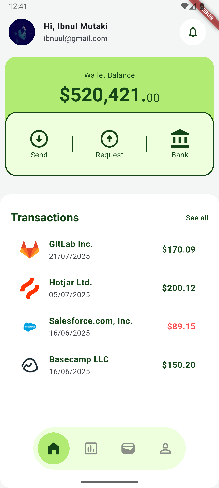

# Diaria UI

Diaria UI is a Flutter repository dedicated to building one UI screen per day. This project aims to improve Flutter UI skills while creating a consistent portfolio of clean, interactive, and modern interfaces.

## Getting Started

For help getting started with Flutter development, view the
[online documentation](https://docs.flutter.dev/), which offers tutorials,
samples, guidance on mobile development, and a full API reference.

## Purpose

- Practice Flutter UI development daily.
- Improve design, animation, and layout skills.
- Build a tangible UI portfolio for recruiters or team showcases.
- Explore design patterns and Flutter best practices.

## Paynex

[Paynex - Finance Mobile App UI KIT](https://ui8.net/orbit-studio-20/products/paynex---finance-mobile-app-ui-kit)

Finance Mobile App Deisgn Clean and Mordern

  Scrren | Pictures
 --- | ---
 [Home]("/lib/app/paynex/paynex_home.dart") | 